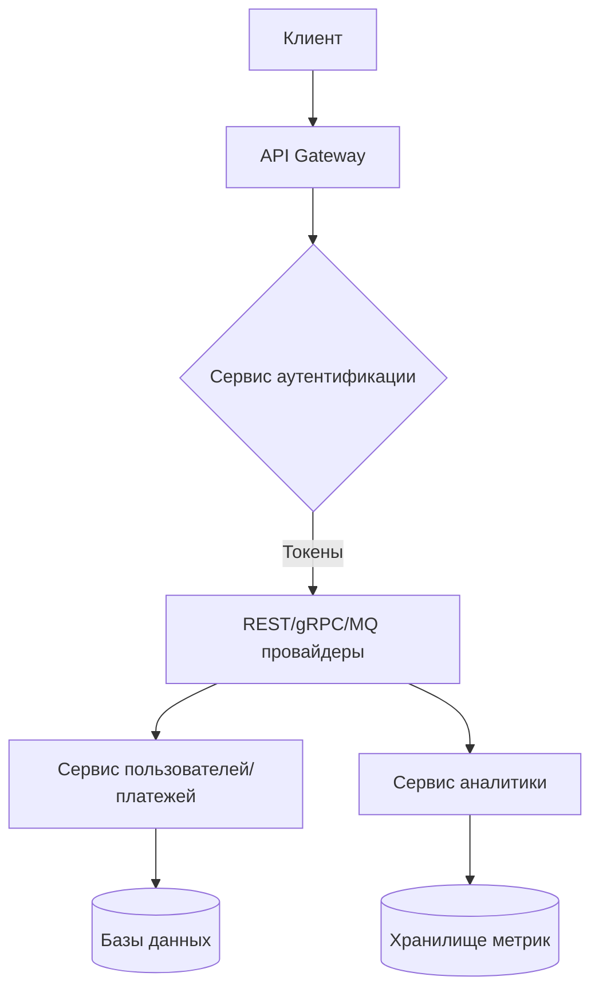

# 🛠 Техническая архитектура Apion

## Основные сервисы платформы

### 🔐 **Сервис аутентификации (Auth)**
**Функционал:**
- Управление учетными записями и сессиями
- Выпуск и валидация токенов доступа
- Контроль прав доступа к API
- Интеграция с внешними провайдерами авторизации

### 👤 **Сервис пользователей (User)**
**Функционал:**
- Хранение профилей пользователей и организаций
- Управление командами и ролями
- Настройки персональных аккаунтов
- Система уведомлений и подписок

### 💰 **Платежный сервис (Payment)**
**Функционал:**
- Обработка подписок и платежей
- Интеграция с платежными системами
- Учет финансовых операций
- Генерация отчетов и аналитики

### 📁 **Сервис медиа (Media)**
**Функционал:**
- Хранение документации и файлов
- Управление изображениями и медиа-контентом
- Кеширование технических спецификаций
- Конвертация форматов файлов

## Сервисы интеграции API

### 🌐 **REST-провайдер**
**Функционал:**
- Маршрутизация HTTP-запросов
- Ограничение частоты запросов
- Трансформация данных
- Кеширование ответов

### ⚡ **gRPC-провайдер**
**Функционал:**
- Проксирование gRPC-вызовов
- Валидация Protocol Buffers
- Мониторинг производительности
- Поддержка gRPC-Web

### 📨 **MQ-провайдер**
**Функционал:**
- Управление подключениями к брокерам сообщений
- Трансформация форматов сообщений
- Балансировка нагрузки
- Мониторинг очередей

## Вспомогательные сервисы

### 📊 **Сервис аналитики**
- Сбор метрик использования API
- Генерация отчетов
- Визуализация данных

### ✉ **Сервис уведомлений**
- Рассылка email и webhook-уведомлений
- Управление шаблонами сообщений
- Очередь событий

### 🧪 **Песочница (Sandbox)**
- Изолированная среда для тестирования
- Мок-серверы для демонстрации
- Контроль ресурсов

## Взаимодействие компонентов

Ключевые особенности архитектуры:
1. **Горизонтальная масштабируемость** каждого сервиса
2. **Изолированные контуры данных** для платежей и пользователей
3. **Единая точка входа** через API Gateway
4. **Event-driven** подход для аналитики и уведомлений

Хотите добавить какие-то специфичные технологии или изменить распределение ответственности?
